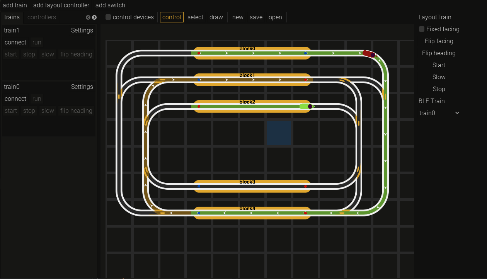

# Brickrail
Work in progress LEGO train automation software

Intended to be used with LEGO PoweredUp trains and LEGO PoweredUp hubs as stationary controllers (for motorized switches) with easy to install and uninstall [`pybricks`](https://pybricks.com/) firmware.
This project contains microphython programs running on the LEGO hardware, a python server that handles BLE communication with the devices, and a GUI running in Godot game engine that also handles the Train route and scheduling logic.
Communication between GUI and python server is done through websockets.
As of now, trains detect their location via a Boost Color and Distance Sensor pointed dowwards onto the track. Colored markers signal the bounds of block sections.



# How to run
Download the Godot Engine binary from the [official website](https://godotengine.org/download). Open the project `brickrail-gui/project.godot`, hit F5.

To run actual LEGO Train, the ble-server needs to run. This is currently still using absolute paths for my environment. The user experience will improve in the future, but to make it run on your setup right now, I recommend to use anaconda, use an environment with python3.9, and then:

```bash
pip install pybricksdev
```

Then adjust the paths in the file `brickrail-gui/ble/ble_process.py` to reflect your environment as well as the location of the repository.
Finally, adjust the paths in `ble-server/ble_hub.py` to reflect the location of the repository.

Instructions for setup of your switches and calibration of the color sensors are coming in the future, as the process is not finalized yet.
